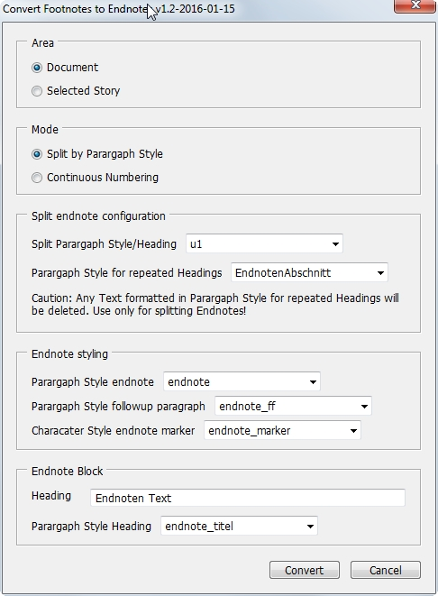

## Endnotes for InDesign
InDesign endnote with the help of  scripting and cross references. 

## How to install
Copy all **.jsx** files in your InDesign Script Panel folder. Further details can be found here [[DE] Skripte in InDesign installieren](http://www.publishingx.de/skripte-installieren/) or here [[EN] How to Install a Typical InDesign Script](http://www.danrodney.com/scripts/directions-installingscripts.html).

## How does it work?
This script converts InDesign footnotes into linked endnotes using InDesign cross references. So you need *footnotes* first. Endnotes are only possible within stories (single or linked textframes), you'll find your endnotes at the end of the story. 
The script should run from InDesign CS4 onwards but was only tested with CS6 and CC 2015.

### Create or update Endnotes
Start **createEndnotes.jsx** 

I hope the user interface is quite self explaining. 

Basically there are two modes:

1. Split by Parargaph Style (Restart Numbering after a Heading)
2. Continuous Numbering 

### Jump between note and marker
Place your cursor in a marker or endnote and start **jumpBetweenMarkerAndNote.jsx**. If you want to go back, simply run the script again. 

### Delete Endnotes
Start **deleteEndnotes.jsx**. This script will delete a single endnote including there cross reference. Do not delete endnotes paragraphs or markers manually, this will break the update process of the current document.

### Default configuration 
All default configuration parameters can be changed in **config.jsx**. 
Configurations settings for style names are save to change. Same for User interface strings. Be careful with the other options, changing them might break the update process of previously converted documents. 

### Logging and errors
In the Script Panel folder you'll find an **endnoteLog.txt** log file. Please send this bug report together with a minimal example of your InDesign document if you encounter any problem.

## Only german? 
The code is ready for localization but I had no time to complete the english translation. Any help is greatly appreciated! You find all UI strings in **config.jsx** within the px.ui object. If you want to help and need further instrcutions please contact me. 

## Acknowledgements
I picked the idea of using InDesign cross references for endnotes from Peter Kahrel. Peters solution is still a good source of inspiration and can be found here [http://www.kahrel.plus.com/indesign/footnotes.html](http://www.kahrel.plus.com/indesign/footnotes.html)

